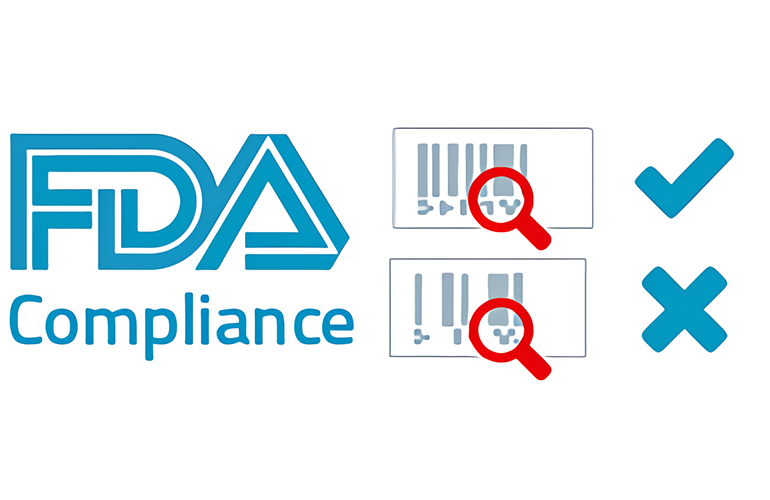

```{r setup, include=FALSE}
knitr::opts_chunk$set(echo = FALSE)

# Learn more about creating websites with Distill at:
# https://rstudio.github.io/distill/website.html

# Learn more about publishing to GitHub Pages at:
# https://rstudio.github.io/distill/publish_website.html#github-pages
# library(htmltools)

```


```{r, comment=FALSE, fig.align='center', out.width = "80%"}
# knitr::include_graphics("images/dashboard.png")

```

<h6>This image was downloaded from: https://www.medicaldesignandoutsourcing.com/fda-pauses-domestic-inspections-due-to-coronavirus/</h4>


<br>

Retailer compliance inspection strategies reduce youth access to tobacco products. One goal of this project is to provide an optimal way of selecting tobacco retailers for inspection. We propose an approach based on multi-level propensity score model (PSM) to predict the retail violation of sales to minors (RVSM).  

<br>
  
:::: {.blackbox data-latex=""}
::: {.center data-latex=""}
**Contact us to try our tool!**
:::

[Go to "Tool Request Form"!](dataRequest.html)

::::


<br>

This website also includes information and publications of different small area estimation projects completed related to youth tobacco consumption. Please refer to the "Articles" page to view some of the related articles.

The dashboard displayed by the following link provides easy access to locate retailer for inspection based on random sampling, and or based on the high risk retailers.

<br>


:::: {.blackbox data-latex=""}
::: {.center data-latex=""}
**Explore Retail Violation Locations!!!**
:::
[Click here to view dashboard!](https://niroapps.shinyapps.io/RetailCheck/)
::::

<br>

```{r fig.height=500}
# knitr::include_graphics("images/dashboard.png")
knitr::include_graphics("images/dash_map1.png")
```

